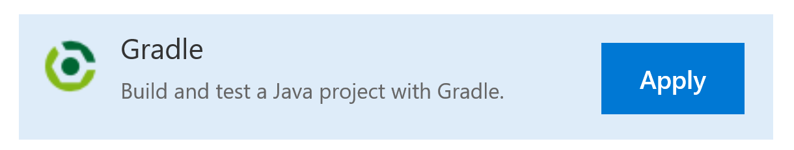
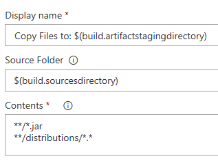
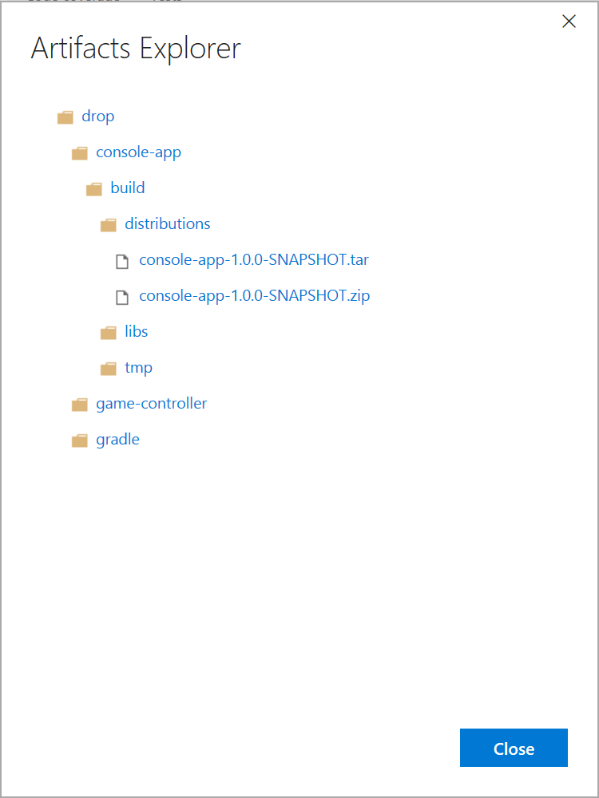

# Technical information for setting up the ALM infrastructure for the Battleship Case Study
(Living documentation)
## VSTS Java Build 
You can build the Java version of the Case Study with VSTS.
1. Select Gradle as build template

2. Select "Hosted Linux Preview" as Agent queue

3. Include the distribution files to the Copy Files task by adding **/distributions/*.* to the contents field

4. After the build is finished, you can download and execute the application from the artifacts drop by extracting 
the archive in the distributions folder. It contains a .bat file to execute the application on Windows.

