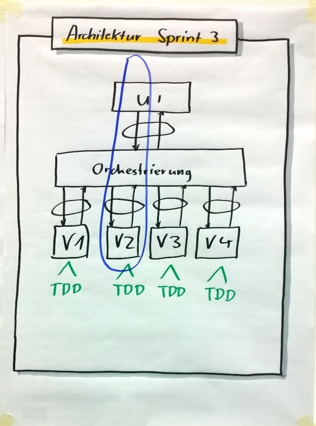

# Battleship Trainer Guide
## Purpose of this guide
This guide will help you to deliver the PSD training using the Battleship case study. 
This case study has a lot of great learning opportunities in it. 
So please read this guide carefully to get out the most from using battleship.

## Case Study Background
The Battleship case study is a lot of fun because students will build a computer game. 
To introduce the students, you can tell a nice story around it - usually during the Case Study Kickoff exercise. 

Here is an example:

> I as a Product Owner have a great gut about the next big trend in computer games. It will be "Retro Games"! 
> There will be a growing group of older players who want to play games reminding them about their childhood.
>
> We as a company want to be one of the first entering this new market. We have bought a product that is almost marketable. 
> We just have to fix a few minor issues. 
> Unfortunately, we weren’t able to get developers from the former team onboard, but now I have you as Development Teams. 
> 
> The quality seems to be decent enough, I as the Product Owner have checked that. 
> I know that there is an unmistakable sign for quality in software which you all might know - Unit Tests! 
> And our product has Unit Tests!
> 
> So, I'm sure we will rock the market. 
> Please have a look at the code and game yourself. I would be interested in your opinion on its quality.  

The students should be able to get the code and compile and start the application at this point in time.

## Estimation Exercises
* Print the PBIs and hand out PBIs 1-10 for estimating (PBIs 11-14 will be handed out in later Sprints). 
You can download a Word document from the GitHub repo containing the default PBIs.
* If PBI 1 is estimated very big, please clarify misunderstandings. 
Some teams plan to visualize the board – which is not the case, this is about coloring of existing messages.
* If no or only a few questions are being asked while estimating tell the team that they are an essential part 
of the refinement process and lead to improved understanding.
* Do not proactively raise details and don't push clarifications, just answer the questions from the teams. 
This will allow you to bring up misunderstandings during Sprint Review and point out how a better refinement would have helped here.

## Sprint 1

***Sprint Goal: I want a presentable version of the game to collect customer feedback***

### PBIs

| ID | Title | Prio |
|--|--|--|
| 1 | Make the game more readable | Must |
| 2 | Indication when a ship has been sunk | Should |
| 3 | Game does not end | Should |
| - | Bugs identified by team e.g. crash after entering invalid positions | Can |
| 5 | You can shoot at positions outside the playing field | Can |

*The Prio indicates how important the PBI is to achieve the expected learnings during this sprint. 
It's up to your ability to push the team to forecast all important items without messing up with the Scrum rules* 

Here are some hints how you could act as a Product Owner during Sprint 1. 
Each trainer might have his own style or strategy so see this as a starting point and then find out 
what works best for you by experimenting.

There are more details about each PBI in the [PBIs background document](PBIsBackground.md) which helps you better understand how it is 
intended and how to use it to gain the learnings.

### Product Owner Behavior
* During Sprint 1 you play a Product Owner ordering features in Sprint Planning and then criticize the
implementation during Sprint Review.
* Very passive or even absent during the sprint. You can say 
"Oh, I'm the trainer. The Product Owner is in an important meeting right now.". 
This works best if you wear a hat or something like that to indicated when you are playing the Product Owner.
* Do not request a Backlog Refinement, only do it if the teams ask you or be the absent Product Owner.

### Sprint Review Feedback
The first sprint should be about learning by failure so you should criticize the results recklessly but factually.
Here are some questions / observations which might bring teams into trouble :-)

* Ask "What was the Sprint Goal?". Can they remember? Was it present during the sprint?
* Ask if they have a Done Increment according to their Definition of Done.
* Some teams haven't defined the colors for hit, miss and messages with you.
Your chance to request different colors than they implemented.
* If teams ask which colors you want, ask for Blue (miss = water) and Red (hit). 
Those colors are hard to read on a projector with a black background. The team did not test on target platforms.
Maybe remind them of the Sprint Goal which was a presentable version and I usually present with a projector.
* There is a bug that computer shoot on row 0, e.g. F0. Did the team find this bug during the sprint. 
How did they handle it?
* Is text they added in English? For none-English teams sometimes they add in their native language.
* Is the presentation in the Sprint Review well prepared? You and the very important and busy stakeholders 
don't want to wait for ages until the demo starts because no one from the team knows how to connect the projector.
* If the team starts the presentation from the IDE you ask if our customers need the IDE to start it as well.
* If they fixed the bug that the game does not end, ask if the computer can win as well and how they tested this.

### Learnings
During Sprint 1 there are usually learning opportunities like these:
* Clarify with the Product Owner, don’t guess.
* The Development Team is responsible for quality.
* Sprint Goal needs to be available and in focus, not just focus on PBIs.
* Accept feedback to improve your way of working. Use critics during Sprint Review as learning opportunities.
* The importance of “Done” (== releasable)

This sprint is especially important to let the team experience how big the improvements in their way of working 
can be if they use the retrospective and live openness. 

## Sprint 2

***Sprint Goal: The game has to become more challenging***

### PBIs

| ID | Title | Prio |
|--|--|--|
| - | Findings from Sprint 1 | Must |
| 6 | Computer shall place its ships randomly | Must |
| 11 | Computer should not shoot at the same position multiple times | Should |
| - | Known bugs | Should |
| 12 | Computer is supposed to search for adjacent positions after a hit | Can |
| 13 | Computer shall search for good shooting positions based on the remaining ships | Can |

### Product Owner Behavior
* Product Owner is more cooperative.
* Request Backlog Refinement.
* Suggest ways to slice PBIs, if the team has no good ideas (s. PBI notes).

### Sprint Review Feedback
This sprint introduces some challenges by the randomness of ship placement.

* Ask "What was the Sprint Goal?". Can they remember? Was it present during the sprint?
* Ask if they have a Done Increment according to their Definition of Done.
* Has the team prepared well to demo the random placement? 
* How can you prove that the computer doesn’t hit the same position twice?
Here you could explain (as a trainer) that it might be legitimate to show and explain tests 
* The Product Owner hates surprises, so communicate the status early on, not in the Sprint Review

### Learnings
During Sprint 2 there are usually learning opportunities like these:
* New testing challenges due to randomness: use unit testing.
* The more Sprint findings we have from the previous sprint, the less time we can use to implement new features.
-> Done is an important concept.
* Every team member can contribute to the Sprint Goal even without coding knowledge, 
e.g. preparing the Sprint Review or testing.
* No Refinement increases the time needed for Sprint Planning. We haven't done Backlog Refinement during Sprint 1 
but there is a big need to split the PBIs most important for the Sprint Goal.
If you are struggling with the time-box you maybe should invest more in Backlog Refinement.
* What can we do if the time-box for Sprint Planning exceeds? 
* Use Daily Scrums to plan towards the Sprint Goal

This sprint helps to understand that achieving quality and a Done Increment is not easy. The team needs to 
use a mixture from the techniques of the Quality Software module to achieve this.

## Sprint 3

***Sprint Goal: The game has to become more compliant to rules***

You can consider combining this sprint with Sprint 4 by giving different goals and PBIs to different teams. 

### PBIs

| ID | Title | Prio |
|--|--|--|
| - | Findings from Sprint 2 | Must |
| 4 | Validate ship placement | Must |

A primary goal in this sprint is to explain and show the advantages of swarming. To enforce this you provide just a single PBI.

### Learnings
The focus of this sprint is on swarming, TDD and architecture enabling both concepts. 
You might prepare this sprint with a group discussion and build an architecture concept with the whole group. 
You can explain that Sprint Planning can get that technical.
* Encourage swarming by only allowing PBI 4 into the Sprint
* Prepare the Sprint well with all Development Teams in advance
* Explain swarming and ask the students if they think PBI 4 can be implemented by all team members in parallel
* Ask the teams to use TDD in order to develop the functionality

Architecture is key in order to parallelize the implementation of PBI 4. 
One possible solution might be small validation methods that are chained together by an orchestration method.
The single validation methods can easily be implemented using TDD. And this provides a great example on slices vs. layers.
Ask the teams to try to implement a slice with just a single validation first and then extend it with additional validations.

This sprint is a great Aha-moment for many teams. They experience how all the theoretical concepts come together and help 
them to achieve their goals.

## Sprint 4

***Sprint Goal: We need a “wow” effect***

### PBIs

| ID | Title | Prio |
|--|--|--|
| - | Findings from Sprint 2/3 | Must |
| 14 | Cool Happy Ending | Must |
| 10 | Two human players | Can |

### Product Owner Behavior
* Prepare this Sprint well during Sprint 2/3 Backlog Refinement.
* Explain that our investors become impatient and we need something special to excite them.
* Product Owner and Development Team work closely together to create that “wow” effect during the sprint. Inspire them. 
* As Product Owner offer your support, give feedback and work together with the Development Team as a real Scrum Team. 

### Sprint Review Feedback
* Change your wording from "What was our Sprint Goal" to "Dear stakeholders, during this sprint, our Sprint Goal was..." 
to demonstrate that you as a Product Owner are part of the Scrum Team and no longer "ordering" features. 
* Make this a fun and positive event so people leave the training with this positive experience how Scrum can work.
* Maybe make "winning photos" from the teams.

### Learnings
* Closely collaborate with the Product Owner to be successful
* How a Scrum Team optimally collaborates
* The goal is to meet the expectations behind the requirements, not tick off acceptance criteria formally
* Many questions regarding the details of Product Backlog Items can be solved during the Sprint while collaborating with 
the Product Owner instead of “writing better PBIs”

